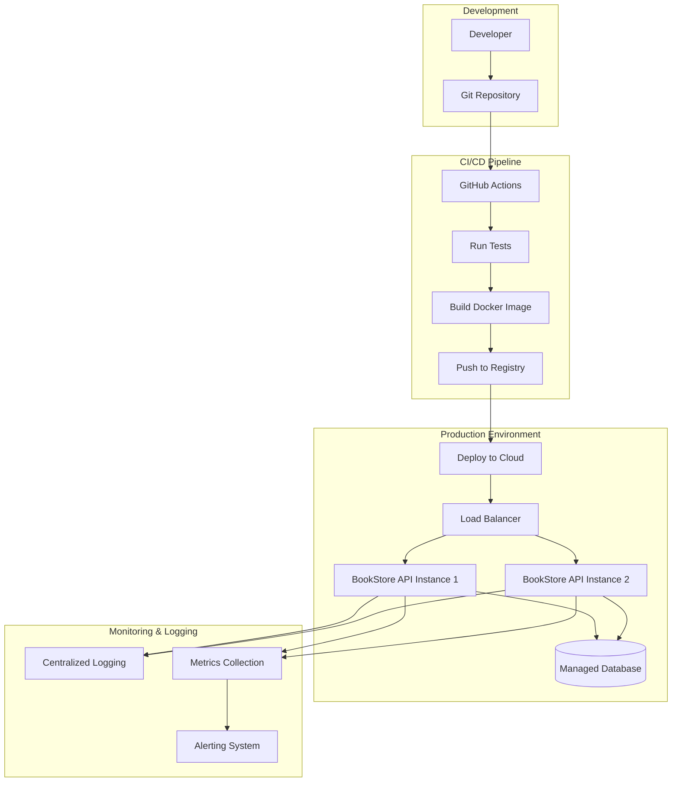

# Design Document: DevOps и Production-Ready Development

## Overview

Создание полноценной production-ready системы для BookStore API с использованием современных DevOps практик. Система будет включать контейнеризацию с Docker, автоматизированный CI/CD пайплайн, мониторинг, логирование и deployment в облако.

## Architecture



## Components and Interfaces

### 1. Docker Containerization

**Dockerfile Structure:**
- Multi-stage build для оптимизации размера
- Base image: Python 3.11-slim
- Non-root user для безопасности
- Health check endpoint

**Docker Compose:**
- API service
- PostgreSQL database
- Redis для кэширования
- Nginx как reverse proxy

### 2. CI/CD Pipeline (GitHub Actions)

**Workflow Stages:**
1. **Lint & Test**: Проверка кода и запуск тестов
2. **Security Scan**: Сканирование уязвимостей
3. **Build**: Создание Docker образа
4. **Deploy Staging**: Развертывание в staging
5. **Deploy Production**: Развертывание в production (manual approval)

**Environments:**
- Development: Локальная разработка
- Staging: Автоматическое развертывание для тестирования
- Production: Ручное развертывание после approval

### 3. Configuration Management

**Environment Variables:**
```python
# Production Configuration
DATABASE_URL: str
REDIS_URL: str
SECRET_KEY: str
JWT_SECRET_KEY: str
LOG_LEVEL: str = "INFO"
ENVIRONMENT: str = "production"
```

**Configuration Profiles:**
- `config/development.py`
- `config/staging.py`
- `config/production.py`

### 4. Logging System

**Structured Logging:**
```python
{
    "timestamp": "2024-01-10T10:00:00Z",
    "level": "INFO",
    "service": "bookstore-api",
    "request_id": "uuid-here",
    "user_id": "123",
    "endpoint": "/api/v1/books",
    "method": "GET",
    "status_code": 200,
    "response_time_ms": 45,
    "message": "Books retrieved successfully"
}
```

**Log Levels:**
- ERROR: Ошибки приложения
- WARN: Предупреждения
- INFO: Информационные сообщения
- DEBUG: Отладочная информация

### 5. Monitoring and Metrics

**Application Metrics:**
- Request count and rate
- Response time percentiles
- Error rate
- Active connections
- Database query performance

**Infrastructure Metrics:**
- CPU usage
- Memory usage
- Disk I/O
- Network I/O
- Container health

**Health Check Endpoint:**
```python
GET /health
{
    "status": "healthy",
    "timestamp": "2024-01-10T10:00:00Z",
    "version": "1.0.0",
    "checks": {
        "database": "healthy",
        "redis": "healthy",
        "disk_space": "healthy"
    }
}
```

### 6. Security Implementation

**Security Headers:**
- HTTPS enforcement
- CORS configuration
- Rate limiting
- Security headers (HSTS, CSP, etc.)

**Authentication & Authorization:**
- JWT tokens with expiration
- Role-based access control
- API key authentication for services

**Container Security:**
- Non-root user
- Minimal base image
- Security scanning
- Secrets management

## Data Models

### Configuration Model
```python
class Settings(BaseSettings):
    # Database
    database_url: str
    
    # Redis
    redis_url: str = "redis://localhost:6379"
    
    # Security
    secret_key: str
    jwt_secret_key: str
    jwt_expire_minutes: int = 30
    
    # Logging
    log_level: str = "INFO"
    log_format: str = "json"
    
    # Environment
    environment: str = "development"
    debug: bool = False
    
    # Performance
    workers: int = 4
    max_connections: int = 100
    
    class Config:
        env_file = ".env"
```

### Monitoring Models
```python
class HealthCheck(BaseModel):
    status: str
    timestamp: datetime
    version: str
    checks: Dict[str, str]

class Metrics(BaseModel):
    request_count: int
    avg_response_time: float
    error_rate: float
    active_connections: int
```

## Correctness Properties

*A property is a characteristic or behavior that should hold true across all valid executions of a system-essentially, a formal statement about what the system should do. Properties serve as the bridge between human-readable specifications and machine-verifiable correctness guarantees.*

### Property 1: Container Consistency
*For any* Docker build, the resulting container should include all required dependencies and start successfully
**Validates: Requirements 1.1, 1.2**

### Property 2: CI/CD Pipeline Reliability
*For any* code push to main branch, the CI/CD pipeline should run all tests and only deploy if tests pass
**Validates: Requirements 2.1, 2.2, 2.5**

### Property 3: Configuration Validation
*For any* environment configuration, all required settings should be present and valid
**Validates: Requirements 4.1, 4.2**

### Property 4: Health Check Accuracy
*For any* health check request, the response should accurately reflect the current system state
**Validates: Requirements 3.5**

### Property 5: Log Structure Consistency
*For any* log entry, it should follow the defined JSON structure and include required fields
**Validates: Requirements 3.1, 3.2**

### Property 6: Performance SLA Compliance
*For any* API request under normal load, response time should be within defined SLA limits
**Validates: Requirements 7.1**

### Property 7: Security Headers Presence
*For any* HTTP response in production, required security headers should be present
**Validates: Requirements 6.1, 6.4**

### Property 8: Database Migration Idempotency
*For any* database migration, running it multiple times should produce the same result
**Validates: Requirements 5.1, 5.2**

## Error Handling

### Container Errors
- Build failures with detailed logs
- Runtime errors with restart policies
- Resource exhaustion handling

### CI/CD Errors
- Test failures block deployment
- Build failures with notifications
- Deployment rollback on errors

### Application Errors
- Graceful degradation
- Circuit breaker pattern
- Retry mechanisms with exponential backoff

### Monitoring Errors
- Alert fatigue prevention
- False positive reduction
- Escalation procedures

## Testing Strategy

### Infrastructure Testing
- **Container Tests**: Verify Docker builds and runs correctly
- **CI/CD Tests**: Test pipeline stages and deployments
- **Configuration Tests**: Validate environment configurations

### Integration Testing
- **Health Check Tests**: Verify monitoring endpoints
- **Security Tests**: Test authentication and authorization
- **Performance Tests**: Load testing and benchmarking

### Property-Based Testing
- **Configuration Properties**: Test all environment combinations
- **Container Properties**: Test various deployment scenarios
- **Security Properties**: Test authentication edge cases

**Testing Tools:**
- pytest for unit and integration tests
- testcontainers for container testing
- locust for load testing
- safety for security scanning

### Test Configuration
- Minimum 100 iterations per property test
- Each test tagged with feature reference
- Automated test execution in CI/CD pipeline
- Performance benchmarks with SLA validation

## Implementation Plan

### Phase 1: Containerization (14:00-15:30)
1. Create optimized Dockerfile
2. Setup docker-compose for local development
3. Implement health checks
4. Test container deployment

### Phase 2: CI/CD Pipeline (15:30-16:30)
1. Setup GitHub Actions workflows
2. Implement automated testing
3. Configure Docker registry
4. Setup staging deployment

### Phase 3: Monitoring & Logging (16:30-17:30)
1. Implement structured logging
2. Add application metrics
3. Setup health check endpoints
4. Configure alerting

### Phase 4: Production Deployment (17:30-18:00)
1. Setup cloud infrastructure
2. Configure production environment
3. Implement security measures
4. Deploy and validate system