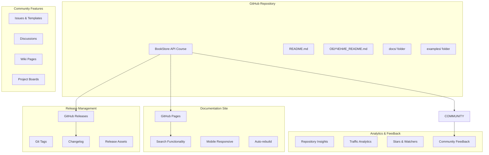

# Design Document: GitHub Repository Publication & Community Setup

## Overview

Создание полноценной образовательной платформы на GitHub для курса BookStore API с настройкой сообщества, документации, процессов поддержки студентов и системы управления контентом.

## Architecture



## Components and Interfaces

### 1. Repository Structure

**Main Files:**
```
bookstore-api/
├── README.md                    # English main page
├── README_RU.md                # Russian version
├── ОБУЧЕНИЕ_README.md          # Main course page (Russian)
├── CONTRIBUTING.md             # Contribution guidelines
├── CHANGELOG.md                # Version history
├── LICENSE                     # MIT License
├── .github/
│   ├── ISSUE_TEMPLATE/         # Issue templates
│   ├── PULL_REQUEST_TEMPLATE.md
│   └── workflows/              # CI/CD workflows
├── docs/                       # Documentation
│   ├── БЫСТРЫЙ_СТАРТ.md
│   ├── СТРУКТУРА_ПРОЕКТА.md
│   ├── РУКОВОДСТВО_ПО_ТЕСТИРОВАНИЮ.md
│   └── DOCKER_И_DEVOPS_РУКОВОДСТВО.md
└── examples/                   # Code examples and cheatsheets
    ├── fastapi_cheatsheet.md
    ├── testing_cheatsheet.md
    └── oop_cheatsheet.md
```

### 2. Community Templates

**Issue Templates:**
```yaml
# .github/ISSUE_TEMPLATE/question.yml
name: 📚 Вопрос по курсу
description: Задайте вопрос о материалах курса
title: "[ВОПРОС] "
labels: ["question", "help wanted"]
body:
  - type: dropdown
    id: level
    attributes:
      label: Уровень курса
      options:
        - "🟢 Уровень 1: Основы Python"
        - "🟡 Уровень 2: FastAPI"
        - "🟠 Уровень 3: Тестирование"
        - "🔴 Уровень 4: DevOps"
  - type: textarea
    id: question
    attributes:
      label: Ваш вопрос
      description: Опишите подробно ваш вопрос
    validations:
      required: true
```

**Pull Request Template:**
```markdown
## 📝 Описание изменений

Краткое описание того, что изменено в этом PR.

## 🎯 Тип изменений

- [ ] 📚 Обновление документации
- [ ] 🐛 Исправление ошибки
- [ ] ✨ Новая функциональность
- [ ] 🔧 Улучшение кода
- [ ] 🧪 Добавление тестов

## ✅ Чек-лист

- [ ] Код следует стилю проекта
- [ ] Добавлены тесты для новой функциональности
- [ ] Документация обновлена
- [ ] Все тесты проходят
```

### 3. GitHub Pages Configuration

**_config.yml:**
```yaml
title: "BookStore API - Курс Python разработки"
description: "Полный курс современной Python разработки от основ до production"
baseurl: "/bookstore-api-course"
url: "https://username.github.io"

markdown: kramdown
highlighter: rouge
theme: minima

plugins:
  - jekyll-feed
  - jekyll-sitemap
  - jekyll-seo-tag

navigation:
  - title: "Главная"
    url: "/"
  - title: "Быстрый старт"
    url: "/docs/БЫСТРЫЙ_СТАРТ"
  - title: "Учебный план"
    url: "/ОБУЧЕНИЕ_README"
  - title: "Примеры"
    url: "/examples/"

collections:
  docs:
    output: true
    permalink: /:collection/:name/
  examples:
    output: true
    permalink: /:collection/:name/
```

### 4. Release Management

**Release Template:**
```markdown
# 🎉 BookStore API Course v{{ version }}

## 🚀 Что нового

### ✨ Новые функции
- Добавлен раздел о микросервисах
- Обновлены примеры Docker конфигураций
- Новые практические задания

### 🐛 Исправления
- Исправлены опечатки в документации
- Обновлены устаревшие зависимости
- Улучшена структура навигации

### 📚 Обновления документации
- Переведены новые разделы на русский язык
- Добавлены диаграммы архитектуры
- Обновлены ссылки на внешние ресурсы

## 📊 Статистика

- **Новых материалов:** X страниц
- **Обновленных примеров:** Y файлов
- **Исправленных ошибок:** Z issues

## 🙏 Благодарности

Спасибо всем участникам, которые помогли улучшить курс:
- @contributor1 - улучшение документации
- @contributor2 - исправление ошибок в коде
- @contributor3 - перевод материалов

## 📥 Скачать

- [Исходный код (zip)](link-to-zip)
- [Исходный код (tar.gz)](link-to-tar)
- [Документация PDF](link-to-pdf)
```

### 5. Analytics Dashboard

**Metrics to Track:**
```python
class RepositoryMetrics:
    # Traffic metrics
    views: int
    unique_visitors: int
    clones: int
    
    # Engagement metrics
    stars: int
    forks: int
    watchers: int
    
    # Community metrics
    issues_opened: int
    issues_closed: int
    pull_requests: int
    discussions: int
    
    # Content metrics
    documentation_pages: int
    code_examples: int
    course_completions: int
```

### 6. SEO Optimization

**Meta Tags:**
```html
<meta name="description" content="Полный курс современной Python разработки - FastAPI, Docker, Kubernetes, DevOps. От основ до production-ready системы.">
<meta name="keywords" content="python, fastapi, docker, kubernetes, devops, курс, обучение, tutorial, api, тестирование">
<meta property="og:title" content="BookStore API - Курс Python разработки">
<meta property="og:description" content="Изучите современную Python разработку от основ до production">
<meta property="og:image" content="https://repository-url/assets/course-preview.png">
<meta name="twitter:card" content="summary_large_image">
```

**GitHub Topics:**
```
python
fastapi
docker
kubernetes
devops
tutorial
course
education
api
testing
ci-cd
monitoring
production-ready
russian
обучение
```

## Data Models

### Repository Configuration
```python
class RepositoryConfig(BaseModel):
    name: str = "bookstore-api-course"
    description: str = "🎓 Полный курс современной Python разработки"
    homepage: str = "https://username.github.io/bookstore-api-course"
    topics: List[str] = [
        "python", "fastapi", "docker", "kubernetes", 
        "devops", "tutorial", "education", "russian"
    ]
    has_issues: bool = True
    has_wiki: bool = True
    has_discussions: bool = True
    has_projects: bool = True
    
class CommunitySettings(BaseModel):
    issue_templates: List[str]
    discussion_categories: List[str]
    labels: List[Dict[str, str]]
    code_of_conduct: str
    contributing_guidelines: str
```

### Course Structure
```python
class CourseLevel(BaseModel):
    level: int
    name: str
    description: str
    duration_days: int
    materials: List[str]
    assignments: List[str]
    
class CourseStructure(BaseModel):
    title: str = "BookStore API - Курс Python разработки"
    description: str
    total_duration_weeks: int = 4
    levels: List[CourseLevel]
    prerequisites: List[str]
    learning_outcomes: List[str]
```

## Correctness Properties

### Property 1: Repository Accessibility
*For any* user accessing the repository, all educational materials should be accessible and properly organized
**Validates: Requirements 1.1, 1.4, 3.1**

### Property 2: Community Feature Functionality
*For any* community interaction (Issues, Discussions), the system should provide appropriate templates and guidance
**Validates: Requirements 2.1, 2.2, 2.4**

### Property 3: Documentation Consistency
*For any* documentation page, it should follow the established structure and be available in the correct language
**Validates: Requirements 3.2, 3.4, 10.1**

### Property 4: Release Completeness
*For any* release created, it should contain all required components and proper versioning
**Validates: Requirements 5.1, 5.2, 5.3**

### Property 5: SEO Optimization
*For any* page in the repository, it should have proper meta tags and keywords for discoverability
**Validates: Requirements 7.1, 7.2, 7.4**

## Implementation Strategy

### Phase 1: Repository Setup (30 minutes)
1. Create GitHub repository with proper settings
2. Upload all project files
3. Configure repository settings and features
4. Create initial release v1.0.0

### Phase 2: Community Features (45 minutes)
1. Setup Issue and PR templates
2. Configure Discussions categories
3. Create Wiki structure
4. Setup project boards for course management

### Phase 3: Documentation Site (60 minutes)
1. Configure GitHub Pages
2. Create navigation structure
3. Setup search functionality
4. Test mobile responsiveness

### Phase 4: SEO and Analytics (30 minutes)
1. Optimize repository for search
2. Setup analytics tracking
3. Configure social media integration
4. Test discoverability

### Phase 5: Community Guidelines (30 minutes)
1. Create comprehensive CONTRIBUTING.md
2. Setup Code of Conduct
3. Create welcome automation
4. Test contributor workflow

## Success Metrics

### Engagement Metrics
- **Stars:** Target 100+ stars in first month
- **Forks:** Target 50+ forks for course customization
- **Issues:** Active community with regular questions
- **Discussions:** Regular community interactions

### Educational Impact
- **Course Completions:** Track through feedback
- **Student Success:** Monitor through testimonials
- **Content Quality:** Measure through ratings
- **Community Growth:** Track contributor participation

### Technical Metrics
- **Documentation Coverage:** 100% of features documented
- **Link Validity:** All links working and up-to-date
- **Mobile Compatibility:** Full mobile experience
- **Search Functionality:** Effective content discovery

## Maintenance Plan

### Regular Updates (Weekly)
- Review and respond to Issues
- Update documentation for accuracy
- Monitor community discussions
- Check for broken links

### Content Updates (Monthly)
- Update dependencies and examples
- Add new learning materials
- Improve existing documentation
- Gather and implement feedback

### Major Updates (Quarterly)
- Release new course versions
- Add new technology coverage
- Expand language support
- Conduct community surveys

### Annual Review
- Comprehensive content audit
- Technology stack updates
- Community growth analysis
- Strategic planning for next year